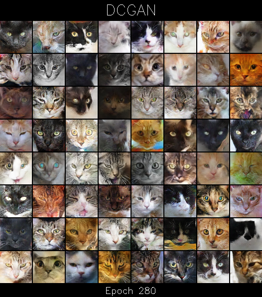
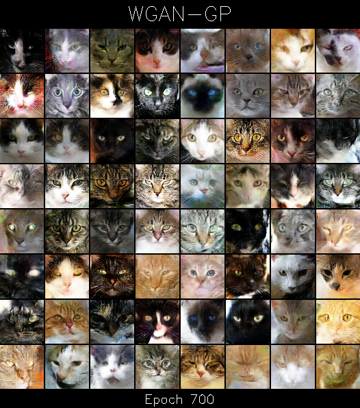
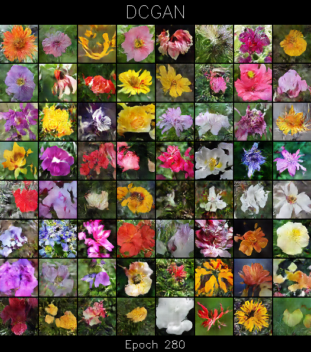
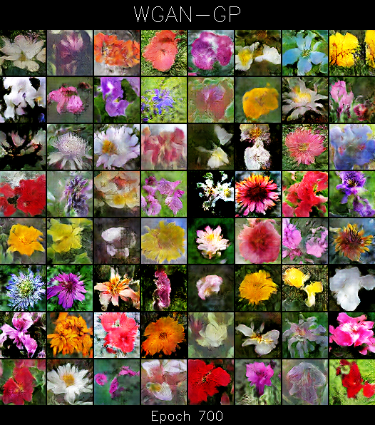

Generating Cats and Flowers with GANs
============================================
A few months ago I saw a [blog post](https://ajolicoeur.wordpress.com/cats/) about generating cat faces with different kinds of generative adversarial networks. I never trained a WGAN before, and I had some free time on my hands so I decided to rewrite the code and try it out myself. I skipped a lot of the parameter tuning and just used the hyper-parameters described in the blog post.


### Requirements
- python 3.6
- opencv-python 
- numpy
- torch **its probably a good idea to use 1.3.0 or higher**

### Experiments
I used DCGAN and WGAN (with gradient penalty).
I run my experiments on the [cat dataset](https://www.kaggle.com/crawford/cat-dataset), and I also tried to generate flowers using the [102 category flower dataset](http://www.robots.ox.ac.uk/~vgg/data/flowers/102/).
In both cases, I downsampled the images to 64x64, and since the datasets share some characteristics, I used the same hyper-parameters.

#### How to re-run the experiments

```
python3 train.py --dataset <DATASET> --gan_type <GAN_TYPE>
```

Where ```<DATASET>``` is either "cats" or "flowers" and ```<GAN_TYPE>``` is one of "dcgan" or "wgan_gp".

### Results
For both datasets and networks, the training was stable, and I ended up with more-or-less good looking, believable cats/flowers.
I trained the DCGAN models for 280 epoch, and the WGAN-GP models for about 700.

 

 
